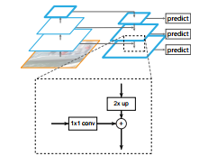
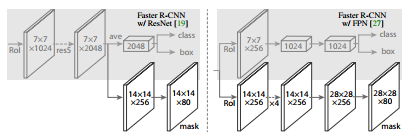

<!--  -->

<div style="text-align:center"></div>


# Lyft Perception Challenge

The [lyft Perception challenge](https://www.udacity.com/lyft-challenge) in association with Udacity had an image segmentation task where the candidates had to submit their algorithm which could segment road and cars pixels precisely in real time. The challenge started on *May 1st,2018* and went through *June 3rd, 2018*.

## Approach
Although it was a segmentation problem and did not require instance segmentation, I went ahead with [MASK-RCNN](https://arxiv.org/pdf/1703.06870.pdf) as it was the state of the art algorithm in image segmentation and I was always intrigued to learn about it. Also I started on *28th*, just after finishing my first term, so transfer learning was my only shot. :sweat:


*Click to Watch on youtube*


<div style="text-align:center;">
	<a href=https://www.youtube.com/watch?v=Q56fzNjmYKc>
		
	</a>
</div>


#### Mask-RCNN (A brief overview)

Mask-RCNN, also known as [Detectron](https://github.com/facebookresearch/Detectron) is a research platform for object detection developed by facebookresearch. It is mainly a modification of Faster RCNN with a segmentation branch parallel to class predictor and bounding box regressor. The vanilla ResNet is used in an FPN setting as a backbone to Faster RCNN so that features can be extracted at multiple levels of the feature pyramid
The network heads consists of the Mask branch which predicts the mask and a classification with bounding box regression branch. The architecture with FPN was used for the purpose of this competition

| Backbone 					| Heads 					 |
|:-------------------------:|:--------------------------:|
|   |  |
| Feature Pyramid network with Resnet | different head architecture with and without FPN |

The loss function consists of 3 losses *L = L<sub>class</sub> + L<sub>box</sub> + L<sub>mask</sub>* where
 - *L<sub>class</sub>*  uses log loss for true classes
 - *L<sub>box</sub>* uses smooth<sub>L1</sub> loss defined in [Fast RCNN]
 - *L<sub>mask</sub>* uses average binary cross entropy loss

The masks are predicted by a [Fully Connected Network](https://arxiv.org/pdf/1605.06211.pdf) for each RoI. This maintains the mxm dimension for each mask and thus for each instance of the object we get distinct masks. 

The model description after compiliation can be found at [model](./assets/model.png)

## Training

The trained weights can be downloaded from [weights](https://drive.google.com/open?id=1UeRD_MvBg7XKsKlysZAdvV6jr9oFRFWU)
The model was trained on Alienware 13R3 with Nvidia-GTX-1060

#### Pre-processing Data
The CARLA datset provided contains train and test images in png format where the masks are in the RED channel of the ground truth mask. 
```python
def process_labels(self,labels):
        
        # label 6 - lane lines pixels
        # label 7 - lane pixels
        # label 10 - car

        labels_new = np.zeros(labels.shape)
        labels_new_car = np.zeros(labels.shape)
        
        lane_line_idx = (labels == 6).nonzero()
        lane_idx = (labels == 7).nonzero()
        car_pixels = (labels == 10).nonzero()

        # remove car hood pixels
        car_hood_idx = (car_pixels[0] >= 495).nonzero()[0]
        car_hood_pixels = (car_pixels[0][car_hood_idx], \
                       car_pixels[1][car_hood_idx])

        labels_new[lane_line_idx] = 1
        labels_new[lane_idx] = 1

        labels_new_car[car_pixels] = 1
        labels_new_car[car_hood_pixels] = 0

        
        return np.dstack([labels_new,labels_new_car])
```

#### MaskRCNN Configuration
For this application Resnet-50 was used by setting `BACKBONE = "resnet50"` in config. `NUM_CLASSES = 1+2` for 2 classes (car,road) and `IMAGE_MAX_DIM = 1024` as image dimensions are 800x600.

```python
class LyftChallengeConfig(Config):
    """Configuration for training on the toy shapes dataset.
    Derives from the base Config class and overrides values specific
    to the toy shapes dataset.
    """
    # Give the configuration a recognizable name
    NAME = "road_car_segmenter"

    # Backbone network architecture
    # Supported values are: resnet50, resnet101
    # BACKBONE = "resnet101"
    BACKBONE = "resnet50"

    # Train on 1 GPU and 8 images per GPU. We can put multiple images on each
    # GPU because the images are small. Batch size is 8 (GPUs * images/GPU).
    GPU_COUNT = 1
    IMAGES_PER_GPU = 1

    # Number of classes (including background)
    NUM_CLASSES = 1 + 2  # background + 2 shapes

    # Use small images for faster training. Set the limits of the small side
    # the large side, and that determines the image shape.
    IMAGE_MIN_DIM = 128
    IMAGE_MAX_DIM = 1024

    # Use smaller anchors because our image and objects are small
    RPN_ANCHOR_SCALES = (8, 16, 32, 64, 128)  # anchor side in pixels

    # Reduce training ROIs per image because the images are small and have
    # few objects. Aim to allow ROI sampling to pick 33% positive ROIs.
    TRAIN_ROIS_PER_IMAGE = 32

    # Use a small epoch since the data is simple
    STEPS_PER_EPOCH = 100

    # use small validation steps since the epoch is small
    VALIDATION_STEPS = 5
```


#### Data Augmentation
As the samples provided were very less (1K), data augmentation was necessary to avoid overfitting. [imgaug](https://imgaug.readthedocs.io/en/latest/) is a python module which came handy in adding augmentation to the dataset. The train function of the MaskRCNN takes augmentation object and augments the images in its generator according to the rules defined in the augmentation object 

```python
augmentation = iaa.SomeOf((0, None), [
        iaa.Fliplr(0.5),
        iaa.Flipud(0.5),
        iaa.OneOf([iaa.Affine(rotate=45),
                   iaa.Affine(rotate=90),
                   iaa.Affine(rotate=135)]),
        iaa.Multiply((0.8, 1.5)),
        iaa.GaussianBlur(sigma=(0.0, 5.0)),
        iaa.Affine(scale=(0.5, 1.5)),
        iaa.Affine(scale={"x": (0.5, 1.5), "y": (0.5, 1.5)}),
    ])
```

Examples of augmentation are given in [https://github.com/matterport/Mask_RCNN](https://github.com/matterport/Mask_RCNN)

#### Training Loss

The model was trained using pretrained CoCo weights.
Instead of a single training loop, it was trained multiple times in smaller epochs to observe change in the loss with changes in parameters and to avoid overfitting. As the data was less, the network used to saturate quickly and required more augmentations to proceed. Also i did not wanted to go overboard on the augmentation so was observing which one works best. Below are the logs of final training setting with the above given augmentation.   

| heads Epoch | all Epoch | loss 							| val_loss 								|
|:-----------:|:---------:|:-------------------------------:|:-------------------------------------:|
| 10 		  | 40		  |  	| 	|
| 40 		  | 100		  |  	|  	|
| 10		  | 40 		  |  	|  	|
| 20		  | 60 		  |  	|  	|


For the purpose of this competition, after 2 training sets I froze the bounding box and class label layer and only trained the masks head by adding 2 new regex (`just_mrcnn_mask`,`heads_mask`) to the layers in train method of Model found in `Mask_RCNN/mrcnn/model.py` also some more augmentation was added.

```python
 layer_regex = {
            # all layers but the backbone
            "heads": r"(mrcnn\_.*)|(rpn\_.*)|(fpn\_.*)",
            
            # just to train the branch dealing with masks
            "just_mrcnn_mask": r"(mrcnn\_mask.*)",
            "heads_mask": r"(mrcnn\_mask.*)|(rpn\_.*)|(fpn\_.*)",
            
            # From a specific Resnet stage and up
            "3+": r"(res3.*)|(bn3.*)|(res4.*)|(bn4.*)|(res5.*)|(bn5.*)|(mrcnn\_.*)|(rpn\_.*)|(fpn\_.*)",
            "4+": r"(res4.*)|(bn4.*)|(res5.*)|(bn5.*)|(mrcnn\_.*)|(rpn\_.*)|(fpn\_.*)",
            "5+": r"(res5.*)|(bn5.*)|(mrcnn\_.*)|(rpn\_.*)|(fpn\_.*)",
            
            # All layers
            "all": ".*",
        }
```

Following is the sample snippet of training function

```python
model.train(dataset_train, dataset_val, 
            learning_rate=config.LEARNING_RATE,
            epochs=2,
            augmentation=augmentation, 
            layers="just_mrcnn_mask")

model.train(dataset_train, dataset_val, 
            learning_rate=config.LEARNING_RATE/10.0,
            epochs=10,
            augmentation=augmentation, 
            layers="heads_mask")
```


## Inference and Submission

### Inference
The inference configuration uses a batch size of only one image. To improve the FPS, a batch of image was taken from the video and was passed to the pipeline but this did not improve the FPS drastically and rather increased the complexity as the test video had odd number of frames.

```python
class InferenceConfig(LyftChallengeConfig):
    GPU_COUNT = 1
    IMAGES_PER_GPU = 1
```

### Submission
Submission requires files to be encoded in a json. `test_inference.py` contains the inference and submission code. In attempt to increase the FPS, The encode function was replaced with the follows which was shared on the forum
```python
def encode(array):
    retval, buffer = cv2.imencode('.png', array)
    return base64.b64encode(buffer).decode("utf-8")
```

## Results

```
Your program runs at 1.703 FPS

Car F score: 0.519 | Car Precision: 0.509 | Car Recall: 0.521 | Road F score: 0.961 | Road Precision: 0.970 | Road Recall: 0.926 | Averaged F score: 0.740
```

The above score was just obtained by the dataset provided.I observed that the class frequency was imbalanced and there were fewer number of samples with cars than roads. This could have been solved by weighing the loss function according to classes but I faced dimension issues while implementing it. The other approach would be to generate more data using Carla simulator or using popular datasets such as Cityscape.

The loss function for masks is given as

```python
def mrcnn_mask_loss_graph(target_masks, target_class_ids, pred_masks):
    """Mask binary cross-entropy loss for the masks head.

    target_masks: [batch, num_rois, height, width].
        A float32 tensor of values 0 or 1. Uses zero padding to fill array.
    target_class_ids: [batch, num_rois]. Integer class IDs. Zero padded.
    pred_masks: [batch, proposals, height, width, num_classes] float32 tensor
                with values from 0 to 1.
    """
    # Reshape for simplicity. Merge first two dimensions into one.
    target_class_ids = K.reshape(target_class_ids, (-1,))
    mask_shape = tf.shape(target_masks)
    target_masks = K.reshape(target_masks, (-1, mask_shape[2], mask_shape[3]))
    pred_shape = tf.shape(pred_masks)
    pred_masks = K.reshape(pred_masks,
                           (-1, pred_shape[2], pred_shape[3], pred_shape[4]))
    # Permute predicted masks to [N, num_classes, height, width]
    pred_masks = tf.transpose(pred_masks, [0, 3, 1, 2])

    # Only positive ROIs contribute to the loss. And only
    # the class specific mask of each ROI.
    positive_ix = tf.where(target_class_ids > 0)[:, 0]
    positive_class_ids = tf.cast(
        tf.gather(target_class_ids, positive_ix), tf.int64)
    indices = tf.stack([positive_ix, positive_class_ids], axis=1)

    # Gather the masks (predicted and true) that contribute to loss
    y_true = tf.gather(target_masks, positive_ix)
    y_pred = tf.gather_nd(pred_masks, indices)

    # Compute binary cross entropy. If no positive ROIs, then return 0.
    # shape: [batch, roi, num_classes]
    loss = K.switch(tf.size(y_true) > 0,
                    K.binary_crossentropy(target=y_true, output=y_pred),
                    tf.constant(0.0))
    loss = K.mean(loss)
    return loss
```

## Code Execution
- training on CARLA dataset
```sh
python train_mrcnn.py
```
- test inference on test_video.mp4
```sh
python inference.py
```
- submission script `test_inference.py`
```sh
grader 'python Lyft_challenge/test_inference.py'
```

## Requirements
Python 3.4, TensorFlow 1.3, Keras 2.0.8, pycocotools and other dependencies required for [https://github.com/matterport/Mask_RCNN](https://github.com/matterport/Mask_RCNN)


## Acknowledgement 
This code heavily uses [https://github.com/matterport/Mask_RCNN](https://github.com/matterport/Mask_RCNN) by [waleedka](https://github.com/waleedka). Thanks for your contribution.


## Reference
```
@misc{Charles2013,
  author = {waleedka et.al},
  title = {Mask R-CNN for Object Detection and Segmentation},
  year = {2018},
  publisher = {GitHub},
  journal = {GitHub repository},
  howpublished = {\url{https://github.com/matterport/Mask_RCNN}},
  commit = {6c9c82f5feaf5d729a72c67f33e139c4bc71399b}
}
```

 - [Mask RCNN](https://arxiv.org/pdf/1703.06870.pdf)
 - [Fast RCNN](https://arxiv.org/pdf/1504.08083.pdf)
 - [Faster RCNN](https://arxiv.org/pdf/1506.01497.pdf)
 - [Feature Pyramid Networks for Object Detection](https://arxiv.org/pdf/1612.03144.pdf)
 - [Fully Connected Network](https://arxiv.org/pdf/1605.06211.pdf)


## Author

Ameya Wagh [aywagh@wpi.edu](aywagh@wpi.edu)