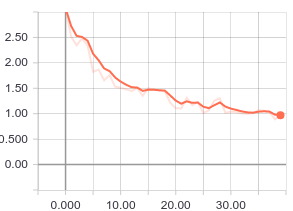
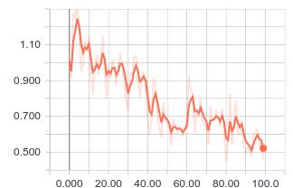
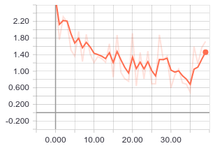
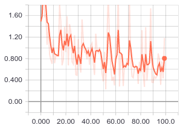
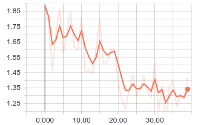
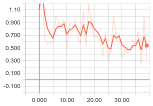
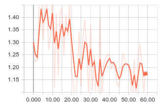
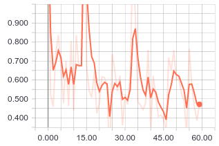

# LYFT Perception Challenge


## Training

<!-- Loss

heads = 10 all = 40 



heads = 40 all = 100



Validation loss



 -->


| heads Epoch | all Epoch | loss | val_loss |
|:-----------:|:---------:|:----:|:--------:|
| 10 		  | 40		  |  |  |
| 40 		  | 100		  |  |  |
| 10		  | 40 		  |  |  |
| 20		  | 60 		  |  |  |


## Reference
https://github.com/matterport/Mask_RCNN
```
@misc{Charles2013,
  author = {waleedka et.al},
  title = {Mask R-CNN for Object Detection and Segmentation},
  year = {2018},
  publisher = {GitHub},
  journal = {GitHub repository},
  howpublished = {\url{https://github.com/matterport/Mask_RCNN}},
  commit = {6c9c82f5feaf5d729a72c67f33e139c4bc71399b}
}
```